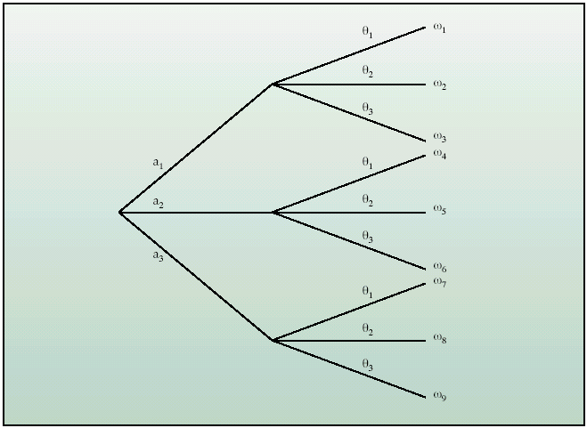
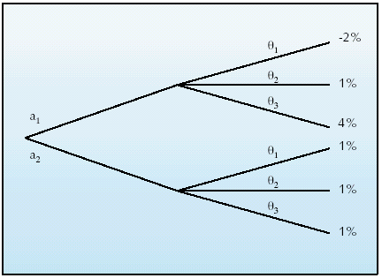
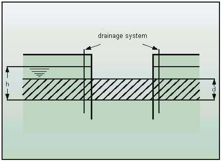
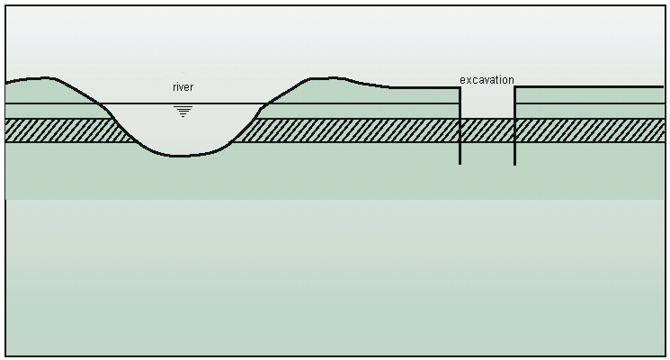

# Decision-making under uncertainty

Decision-making under uncertain conditions is part of everyday life, e.g. when choosing to buy a lottery ticket or choosing to take an umbrella during cloudy weather. In contrast to the rather intuitive decision making in everyday matters, a structured analysis of different alternatives with associated risks, costs and benefits is very useful for decisions in (civil) engineering. This chapter offers a very basic introduction into the decision theory with applications to decision problems in the civil engineering domain. Further reference is made to the work by other scholars for more rigorous and detailed treatment of this topic, see for example (Raiffa and Schlaifer, (1961); Benjamin and Cornell, (1970 ).

### Introduction and basics

Making a decision is in fact choosing from alternatives. The decision theory  is based on the classic “Homo Economicus” model. The Homo Economicus:

 - has complete information about the decision situation;
 - knows all the alternatives;
 - knows the existing situation;
 - knows which advantages and disadvantages each alternative provides, be it in the form of random variables;
 - strives to maximise that advantage (formally called utility).

The decision-making concept discussed in these lecture notes assumes this model. Decision-making in practice is often different since the above conditions will not be fulfilled. There can be multiple decision makers and multiple objectives. Also, the decision maker does not know all the alternatives or their outcomes. For many practical cases this has led to an extension of the decision model, but not to a fundamental adjustment of the classical model.
Within a decision problem the following characteristics can be distinguished: 

  - the set of all possible actions or decisions $\textit{(a)}$, from which the decision maker can choose
  - the set of all (natural) circumstances ( $\theta$ ) that influence the outcomes*
  - the  set of the set of all possible results ( $\omega$ ), which are functions of the actions and circumstances: $\omega = f ( \textit{a} ,\theta )$

The actions, natural circumstances and the outcomes can be shown in a so-called decision tree (Figure 3.3).

<figure>

</figure>
<figcaption align = "center">Figure 3.3 Decision tree .
</figcaption> 
Based on the possible results a choice is made for an action. To be able to assess the different results, a numerical value is assigned to each outcome of $\omega$ , which can be used to establish the benefit of each outcome. This number can be a monetary value, a number on an arbitrary scale or utility - as long as the decision maker(s) can establish a consistent ranking of the outcomes with it. In the last two cases the benefit has no absolute value, but only gives the relative value of the different outcomes. Utility <em> (u)</em>  is a concept used to rank the possible outcomes according to the preferences of the decision maker. Utility <em> (u) </em> values are between $0\leq\textit u ({\omega})\leq 1$ . A utility function can be used to characterize the relative utility of various outcomes. The elaborations below are based on the monetary values as a measure for the outcomes and assume a risk neutral decision maker. This is a decision maker who is indifferent between choices with equal expected outcomes, even if one choice is riskier than the other. For example, a risk neutral decision maker would have the same preference for a € 400 pay out, or a 50/50 bet with a coin toss with outcomes of € 0 (head) or € 800 (tail). Utility and risk aversion are further discussed in section 3.3.3.   

**3.3.2 Decision rules**

Once a set of actions, circumstances and outcomes is known, various approaches can be used to come to a preferred decision. Various deterministic decisions  rules are available which do not take into account the probabilities of the possible circumstances and outcomes. One example of such a decision rule is the minimax criterion: a decision maker wants to minimize maximum losses. This is in fact a risk-averse criterion. Another example is the maximax criterion: a decision maker chooses the option with the maximum income and is risk seeking. 

Although these decision rules are helpful in some cases, the probability of occurrence of certain circumstances is a key feature of the decision problem. Information on the probability of outcomes is needed for an optimal choice of action(s). For example, when making a decision to start a business in soup or ice cream, the decision maker would want to know what the probabilities of rainy or sunny weather are. Selling ice cream in Dutch winter will probably not make a good (expected) profit, but it would be a profitable business in a Mediterranean summer.

Therefore it is necessary to include information on the probabilities of circumstances and outcomes, in order to determine a rational action with the highest expected value of the benefit. This theory is known as the Bayesian decision theory. In a probabilistic or Bayesian decision framework the optimal action a* is defined as the one maximizing the expected utility. The following formula is found for the case with discrete outcomes.      
$$
a^*: \max_a E(u(a, \theta))=\max _a \sum_\theta u(a, \theta) P\left(\theta_i\right)            (3.5)
$$                                                                                                                                                  
In which $u(a, \theta)$  – utility of action a under circumstance $\theta$. $P(\theta)$  is the probability that circumstance $\theta_{i}$ occurs.

A rational decision is choosing the action with the highest expected (utility) value or highest benefit if outcomes are expressed in monetary values. This is illustrated in the example below. Note that other examples in these lecture notes will also be based on monetary values.

**Example 3.1: buying shares or bonds?**

Suppose a person has EUR 1000 at his or her disposal and is given the choice to invest this money in bonds or in shares of a given company.  It is known that, on a yearly basis, 3 % of the current market value is distributed as interest on the bonds. The dividend of the shares depends on the company’s profit. Suppose that the board of directors have made the following agreements: 
* for a profit smaller than 5 % of the shareholders capital, no dividend is paid;
for a profit larger than 5 % of the shareholders capital, dividend is paid, the percentage of which corresponds to 3 % of the current market value of the shares;
* for a profit larger than 10 % of the shareholders capital, the dividend corresponds to 6 % of the current market value of the shares.

The set of actions A has two elements: $a_{1}$= investing in shares AND $a_{2}$= investing in bonds
The set or market circumstances N has three elements, namely:   
  $\theta_{1}$ = company profit ≤5 %  
  $\theta_{2}$= 5 % < company profit ≤ 10 %  
  $\theta_{3}$= company profit > 10 %

Assume the inflation amounts to 2 %. The set of outcomes ω contains three possible outcomes for the shares:
  $\omega_{1}$= return (0 % -2 %) = -2 % per annum
  $\omega_{2}$= return (3 % -2 %) =  1 % per annum
  $\omega_{3}$= return (6 % -2 %) =  4 % per annum

Note that for the bonds the net outcome always yields $\omega_{2}$  =1% (i.e. 3% interest – 2% inflation). The outcomes can be shown in a decision tree (see Figure 3.4) or in a table (see Table 3.3).
Table 3.3 Outcomes given the decisions (a1,a2) and market conditions ($\theta_{1}$,$\theta_{2}$,$\theta_{3}$). 
  
  |  ||Market circumstances||
  |---|-------------------|---|---|
  |Actions|$\theta_{1}$|$\theta_{2}$|$\theta_{3}$
  |$a_{1}$: buy shares|-2 %|1 %|4 %|
  |$a_{2}$: buy bonds |1 %|1 %|1 %|

<figure>

</figure>
<figcaption align = "center">Figure 3.4 Decision tree for the example of buying shares (a_{1}) or bonds ($a_{2}$).</figcaption>  
The deterministic decision rules can be applied to this example. Minimax would result in investing in bonds ($a_{2}$), maximax would result in buying shares.
The optimal decision can be found by taking into account the probabilities of the market circumstances. These three circumstances are assumed to be exhaustive and mutually exclusive (i.e. outcomes cannot overlap and the sum of probabilities equals 1). The probabilities are estimated at $P(\theta_{1})$ = 0.2; $P(\theta_{2})$ = 0.3; $P(\theta_{3})$ = 0.5. These probabilities can now be included in the decision tree.   The expected value of the return of the actions is as follows:

   Buying shares: 0.2(-2 %) + 0.3 (1 %) + 0.5 (4 %) = 1.9 %.  
   Buying bonds: 1%

In this case the expected outcome is larger for buying shares than for buying bonds. So for a risk neutral decision maker buying shares (a1) would be the preferred action. Note that this action also includes a probability of 0.2 of a loss. This is also  expressed by a higher standard deviation of the expected outcomes for buying shares. The above example can also be extended by applying different utility functions for various outcomes.

In the previous example, the number of circumstances is limited and the probability distribution of the circumstances is discrete. For many decision problems this is not the case. The state of nature, for instance, can assume many values that cannot be made discrete. This, for example, would have been the case if the dividend in example 0 had been a percentage of the profit. In such cases a probability density function can be used to characterize the spectrum of outcomes. Using a continuous form of formula (3.5), the expected value of various actions, and the optimal action / decision can be identified. 
In taking decisions with uncertainties, it appears that probabilistic calculation techniques are a valuable aid to reach a rational choice. This is particularly the case if risks are dependent on the possible decisions. In such cases, Bayesian decision theory minimizes the total costs (i.e. investment costs plus risk in terms of potential losses). This can best be illustrated by means of an example from the civil engineering domain.

**Example 3.2: drainage of a construction site – decision tree**

In a river polder a basement has to be built in an excavated construction site. The construction site is made of sheet piling and the bottom is sealed off with a clay layer with a thickness (d) of, on average, $\mu_{d}$ = 2.5 m. The thickness is not known exactly; it follows from measurements that the thickness has a normal distribution and a standard deviation of $\sigma_{d}$ = 0.2 m.
The river cuts through the clay layer and the underlying sand layer is fed by the river (see Figure 3.5). The groundwater potential in the upper layer equals the potential in the deep sand layer. The upward water pressure under the sealing layer is assumed to be a direct function of the river levels. The fluctuating river levels result in fluctuations of the upward pressure under the sealing layer. 
Measurements of the groundwater levels over a long period have given an insight into the extreme groundwater levels. The maximum upward pressure $(\textit h)$ under the sealing layer in the construction period has an a normal distribution with an expected value of $\mu_{h}$ = 4 m water column and a standard deviation of   $\sigma_{\textit h}$= 0.75 m water column.
From these values the probability of flooding due to bursting of the clay layer due to upward water pressure can be calculated for the construction period. We define a limit state function $\textit Z = R - S$ 
$\textit R$ is the strength consisting of the weight of the clay layer and $\textit S$ is the water pressure. We find:
  $$ 
  Z=\rho_c d-\rho_w h (3.6)
  $$  
In which: $\rho_c$  – density of clay (=20kN/m3); $\rho_w$  – density of water (=10 kN/m3) 
The probability of failure $\textit P(Z<0)$ for this situation can be found by calculating the mean and standard deviation of $\textit Z$ :  
     
   $$
   \mu_Z=\rho_c \mu_d-\rho_w \mu_h=202.5-104= 10 \mathrm{kN} / \mathrm{m}^2 \\
   $$
   $$
   \sigma_z=\left(\rho_{\mathrm{c}}^2 \sigma_{\mathrm{c}}^2+\rho_{\mathrm{w}}{ }^2 \sigma_{\mathrm{h}}^2\right)^{0.5}=8.5 \mathrm{kN} / \mathrm{m}^2                                                                                                                                                         (3.7)
   $$           
According to Chapter 2.6.1, we find  $\textit P(Z<0)=\Phi\left(-\mu_z / \sigma_z\right)=\Phi(-1.17)=0.12$. This is indicated as the initial failure probability $P_{f, 0}$   .

<figure>

</figure>

<figcaption align = "center">Figure 3.5 Situation: Excavation near a river </figcaption>  
 
The effect of a drainage system in the construction site (see Figure 3.6) on the groundwater levels has been reviewed using groundwater flow calculations. It appears that it reduces the mean value of the maximum water levels to $\mu _{h}$ = 3.52m and the standard deviation remains the same. In this case the failure probability is reduced to 0.04. Such a drainage system costs EUR 150,000.
 
<figure>

</figure>
<figcaption align = "center">Figure 3.6 Drainage around the excavation. </figcaption>
 
The flooding of the construction site will result in the buoyancy of the basement resulting in damages are estimated at EUR 5,000,000. The designer of the construction site is faced with the choice whether or not to include drainage facilities in the design of the construction site. 
To provide insight the decision problem is illustrated with a decision tree. For this, the sets of actions, circumstances and outcomes have to be defined first:   

The set of actions A consists of:    
  $\textit a_{1}$= excavation without drainage    
  $\textit a_{1}$= excavation with drainage    
The set of circumstances N is formed by:    
  $\theta_{1}$= the sealing layer remains intact     
  $\theta_{2}$= the water pressure exceeds the weight of the sealing layer  
The set of outcomes $\Omega$ consists of:    
  $\omega_{1}$ = nothing happens; loss = € 0    
  $\omega_{2}$ = the construction excavation is flooded: loss =€5,000,000    
The previous eligibility analysis has shown that the probability of flooding of the excavation equals $P_{f}$ = 0.12 for a situation without drainage and $P_{fd}$ = 0.04 with drainage.  
Without drainage, the risk, defined as the expected value of the loss, is: 0.12 · € 5,000,000 = € 600,000. With drainage the risk is: 0.04 · € 5,000,000 = € 200,000. Costs and probabilities can also be shown in the decision tree (see Figure 3.7). The expected values of the costs can be calculated for the different actions by adding the present values of the cost of actions and risk:  
  $\textit a_{1}$ : expected value (additional) costs = risk =€ 600,000  
  $\textit a_{2}$ : expected value (additional) costs = extra costs + risk = € 150,000 + € 200,000 = € 350,000

This implies that the construction of the drainage system is rationally speaking the best decision for a risk neutral decision maker.
 
<figure>

</figure>
<figcaption align = "center">Figure 3.7 Decision tree with probabilities and costs.</figcaption> 

**3.3.3 Utility functions**

The elaborations in the previous sections were based on monetary values as a metric for outcomes and a risk neutral decision maker. This section will provide some basic information on utility functions and various risk attitudes.

Utility is a concept used to rank the possible outcomes according to the preferences of the decision maker. Utility $(\textit u)$ values are between $0\leq \textit{u}(\omega)\leq 1$. A utility function can be used to characterize the relative utility of various outcomes. The utility function depends on the preferences and attitude of the decision maker. An example of three different utility functions is given in Figure 3.8 for an example of an activity with potential monetary benefits between € 0 and € 1000. In the case of a risk neutral decision maker the utility increases linearly with the benefits. In the case of the risk aversion relatively small benefits are already given a high utility. A risk seeking decision maker gives a relatively low value to smaller benefits, but high utility values to larger incomes. 

<figure>

</figure><figcaption align = "center">
Figure 3.8 Example of a utility function for monetary benefits.
</figcaption>  
 

 **Example 3.3: a bet**

The utility functions can be applied to a simple example. Assume that a student has the chance to receive a guranteed payout of €400. Alternatively, a bet can be organized with a $\textit p$ =  0.5 chance of a payout of € 800, and a (1-$\textit p$) = 0.5 chance of no payout. A risk neutral decision maker would be indifferent between both choices, as they have the same expected outcome – i.e. €400 gain – and a utility value of $\textit u$(€400) = $\textit{pu}$(€800)+(1-$\textit p$)$\textit u$(€0)= 0.4.  
We now apply the two other utility functions. For the risk averse function  we find the following:

The expected utility of the direct payout equals $u_{R A}( € 400 )=0.75 $  
The expected utility of the bet becomes: $0.5 u_{R A}(€ 800)+0.5 u_{R A}(€ 0)=0.5 \cdot 0.97+0.5 \cdot 0=0.485$  

In this case the expected utility of the direct payout is higher and this is the preferred decision of the risk averse decision maker. For the risk seeking function  we find the following:

The expected utility of the direct payout equals $u_{R A}( € 400 )$  = 0.1 .  
The expected utility of the bet becomes: $0.5 u_{R S}(€ 800)+0.5 u_{R S}(€ 0)=0.5 \cdot 0.57+0.5 \cdot 0=0.285$   
In this case the expected utility of the bet is higher. The preferred decision of the risk seeking decision maker is the bet.

So for the example of the bet, the risk neutral decision maker is indifferent between the bet and the direct payout. The risk averse decision maker would accept a lower payout, rather than taking the bet. The risk seeking decision maker accepts the bet, even if the guaranteed payout is higher than the expected outcomes of the bet. The same concept can also be applied to losses, a decision-maker can be risk averse against events with large consequences. For example, a civil engineering company could be risk averse in making decisions about bidding for projects with financial risks that could threaten the financial stability of the company. On the other hand, a government with a large portfolio of projects may actask  more risk neutral. The various risk attitudes can also play a role in making investment decisions (see also 3.4.2). A risk averse investor would prefer investments (such as bonds or guaranteed loans with relatively low expected returns) over investments in stocks that have higher expected returns, but also a higher chance of losing money. The principle of risk aversion is also related to decisions about insurances. For example, most people are risk averse against losing their belongings in a large house fire. They are willing to pay an annual premium that is higher than the expected losses due to the fire. Finally, a further discussion of a related risk aversion concept regarding  s accidents with large numbers of fatalities is included in section 3.5.
